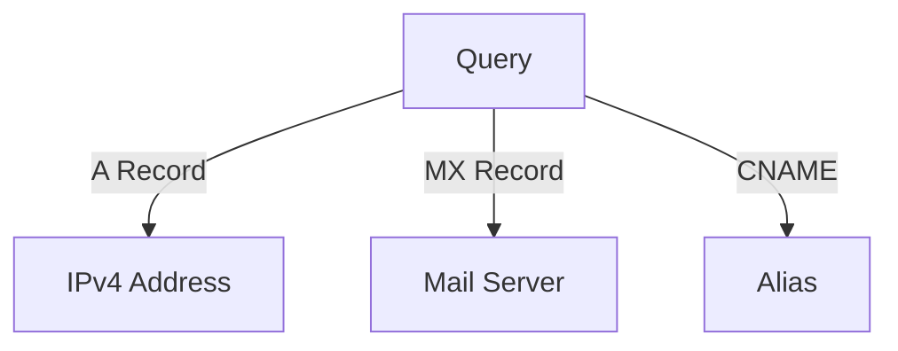

# Cheat Sheets 📜✨

Welcome to the **Cheat Sheets** sub-repository – your one-stop reference hub for concise and powerful guides on **cybersecurity**! 🚀

---

## Table of Contents 🗂️

- [Overview](#overview-)
- [Repository Structure](#repository-structure-)
  - [Linux Commands](#linux-commands-)
  - [DNS Query Types](#dns-query-types-)
  - [Windows Commands](#windows-commands-)
  - [Sysmon Event IDs](#sysmon-event-ids-)
  - [Splunk Query Language](#splunk-query-language-)
  - [Markdown Cheat Sheet](#markdown-cheat-sheet-)
  - [Regex Cheat Sheet](#regex-cheat-sheet-)
  - [Windows Event Codes](#windows-event-codes-)
  - [Keyboard Shortcuts Linux](#keyboard-shortcuts-linux-)
  - [Keyboard Shortcuts Windows](#keyboard-shortcuts-windows-)
  - [Ports & Protocols](#ports--protocols-)
  - [HTTP Response Codes](#http-response-codes-)
- [Features](#features-)
- [Contributing](#contributing-)
- [License](#license-)

---

## Overview 🌟

This repository is packed with **cybersecurity cheat sheets** to empower you with quick access to essential knowledge. Each cheat sheet is crafted for:

- 🔥 Rapid learning and recall
- 💡 Visual representation of key concepts
- 🛠️ Practical use in cybersecurity workflows

> **Tip:** Save this repo for a lifetime of learning! 🌐

---

## Repository Structure 🏗️

Navigate the repository with ease:

```
Cheat_Sheets/
├── README.md
├── Linux_Commands/
├── DNS_Query_Types/
├── Windows_Commands/
├── Sysmon_Event_IDs/
├── Splunk_Query_Language/
├── Markdown_Cheat_Sheet/
├── Regex_Cheat_Sheet/
├── Windows_Event_Codes/
├── Keyboard_Shortcuts_Linux/
├── Keyboard_Shortcuts_Windows/
├── Ports_and_Protocols/
├── HTTP_Response_Codes/
```

### Linux Commands 🐧
- 🖥️ **Basic Linux Commands**: Terminal essentials for navigation and management.

```bash
# Examples
ls -l       # List files with details
chmod 755   # Change file permissions
ping 8.8.8.8 # Test network connectivity
```

### DNS Query Types 🌐
- 🔍 **DNS Record Types**: Explanation and examples of common record types (A, MX, CNAME).



### Windows Commands 🪟
- 🖥️ **Command Prompt & PowerShell**: Command examples and scripting tips.

```cmd
# Examples
ipconfig /all    # Display network configuration
netstat -ano     # View active connections
```

### Sysmon Event IDs 📊
- 📈 **Event IDs Cheat Sheet**: Quick reference for Sysmon events.

| Event ID | Description                        |
|----------|------------------------------------|
| 1        | Process creation                  |
| 3        | Network connection detected       |

### Splunk Query Language 🔎
- **Search Processing Language (SPL)** tips and examples for log analysis.

```spl
# Example Query
index=main | stats count by source_ip
```

### Markdown Cheat Sheet ✍️
- **Markdown Syntax**: Quick formatting guide for documentation.

### Regex Cheat Sheet 🔍
- **Regular Expressions**: Patterns for matching and parsing text.

### Windows Event Codes 🚦
- **Event Log Codes**: Decoding Windows security events.

### Keyboard Shortcuts Linux ⌨️
- 🚀 **Boost Productivity**: Essential Linux shortcuts for efficiency.

### Keyboard Shortcuts Windows ⌨️
- 🌟 **Save Time**: Handy shortcuts for Windows operations.

### Ports & Protocols 📡
- **Common Ports**: Reference table for TCP/UDP ports.

| Port | Protocol | Description               |
|------|----------|---------------------------|
| 80   | HTTP     | Web traffic               |
| 443  | HTTPS    | Secure web traffic        |

### HTTP Response Codes 🌐
- **Status Codes**: Guide to understanding HTTP responses.

| Code | Description                 |
|------|-----------------------------|
| 200  | OK                          |
| 404  | Not Found                   |
| 500  | Internal Server Error       |

---

## Features ✨

- 📄 **Markdown-based Documentation**
- 🔧 **Practical Examples & Commands**
- 📊 **Visual Diagrams**
- 🌟 **Beginner-Friendly and Advanced Topics**

---

## Contributing 🤝

Want to contribute? 🌟 Submit **issues** and **pull requests**! Check out our [contribution guidelines](CONTRIBUTING.md) for more details.

---

## License 📜

This repository is licensed under the [MIT License](LICENSE).

---

> 🌐 "Cheat Sheets: Your ultimate cybersecurity toolkit."
