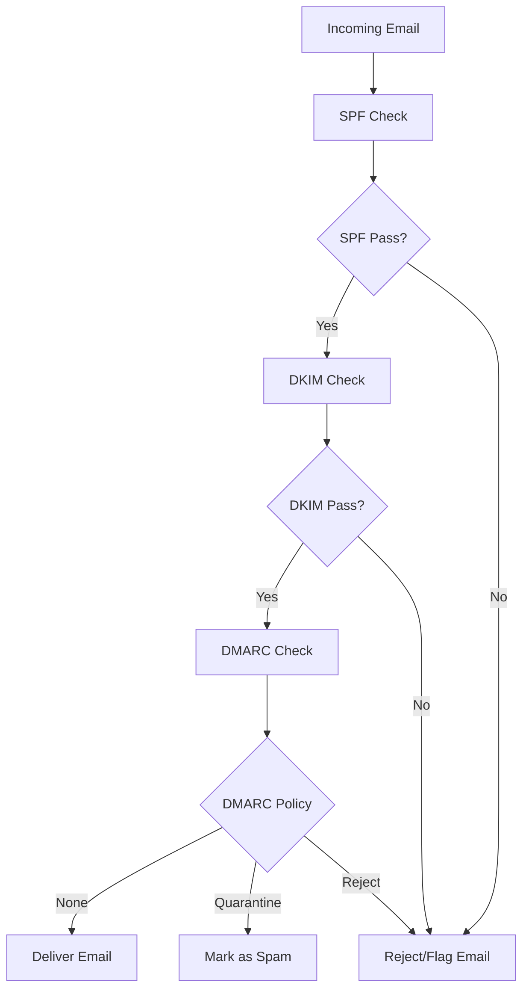

# 📬 **Email Headers: Understanding SPF, DKIM, and DMARC**

Email headers are an essential part of understanding email authentication and security. Let's dive into the key headers related to **SPF**, **DKIM**, and **DMARC** that play a vital role in ensuring email integrity and trustworthiness. ✉️

---

## 🌟 **SPF (Sender Policy Framework)**

SPF helps verify the sender of an email by checking if the sending server is authorized to send mail for a specific domain.

### 🔍 **Key SPF Headers**:

1. **`Received-SPF`**
   - Indicates whether the SPF check passed, failed, or was neutral.
   - Example:
     ```
     Received-SPF: Pass (domain of example.com designates 192.0.2.1 as permitted sender)
     ```

2. **`Authentication-Results`**
   - Contains SPF results as part of the broader authentication results.
   - Example:
     ```
     Authentication-Results: example.com;
         spf=pass smtp.mailfrom=example.com
     ```

### ✅ **SPF Check Outcomes**:
- **Pass**: The email was sent from an authorized server.
- **Fail**: The server is not authorized.
- **Neutral**: No definitive SPF result.

---

## ✍️ **DKIM (DomainKeys Identified Mail)**

DKIM ensures email integrity by attaching a digital signature to the email headers, allowing recipients to verify that the message wasn't altered.

### 🔍 **Key DKIM Headers**:

1. **`DKIM-Signature`**
   - Contains the digital signature and other signing parameters.
   - Example:
     ```
     DKIM-Signature: v=1; a=rsa-sha256; d=example.com; s=selector1;
         h=from:to:subject:date;
         bh=47DEQpj8HBSa+/TImW+5JCeuQeRkm5NMpJWZG3hSuFU=;
         b=...signature...
     ```

2. **`Authentication-Results`**
   - Includes the DKIM verification result.
   - Example:
     ```
     Authentication-Results: example.com;
         dkim=pass header.d=example.com
     ```

### ✅ **DKIM Check Outcomes**:
- **Pass**: The signature is valid.
- **Fail**: The signature is invalid or missing.

---

## 🔒 **DMARC (Domain-based Message Authentication, Reporting, and Conformance)**

DMARC builds on SPF and DKIM by providing a policy for handling authentication failures and generating reports.

### 🔍 **Key DMARC Headers**:

1. **`Authentication-Results`**
   - Summarizes DMARC results based on SPF and DKIM checks.
   - Example:
     ```
     Authentication-Results: example.com;
         dmarc=pass (p=quarantine) header.from=example.com
     ```

2. **`DMARC-Policy`**
   - Indicates the applied DMARC policy.
   - Example:
     ```
     DMARC-Policy: policy=quarantine; pct=100;
     ```

### ✅ **DMARC Policies**:
- **None**: Monitor email traffic without applying restrictions.
- **Quarantine**: Mark failing messages as spam.
- **Reject**: Block failing messages entirely.

---

## 📊 **Visualizing the Flow**



---

## 📖 **Further Reading**

- [SPF Explained](https://www.openspf.org/)
- [DKIM Overview](https://www.dkim.org/)
- [DMARC Guide](https://dmarc.org/)

### 🎉 **Email Security Matters!**