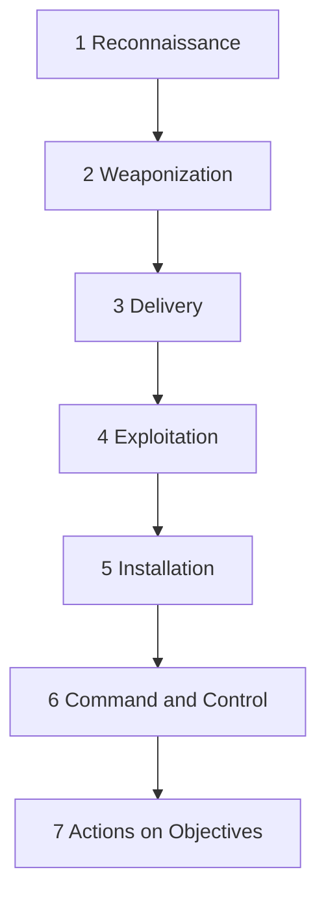

# The Cyber Kill Chain 🔒🖥️
#KA #CTI 

Welcome to **The Cyber Kill Chain** GitHub Page! 🚀 Dive deep into the mechanics of the **Lockheed Martin Cyber Kill Chain** framework and how it helps combat cyber threats.

---

## 🌟 Overview

The Cyber Kill Chain, developed by Lockheed Martin, is a conceptual framework that outlines the phases of a cyberattack. It helps organizations detect, analyze, and respond effectively to malicious activities.

> **"By understanding the steps attackers take, we can better protect our assets."**

---

## 🕵️ The 7 Stages of the Cyber Kill Chain

Below is an interactive diagram illustrating the seven stages of the Cyber Kill Chain:

---

### 1️⃣ **Reconnaissance**
- **Goal:** Gather information about the target.
- **Techniques:**
  - Passive monitoring (e.g., OSINT 🌐)
  - Scanning tools like Nmap 🛡️

### 2️⃣ **Weaponization**
- **Goal:** Craft malicious payloads.
- **Techniques:**
  - Exploit kits 🧰
  - Malware creation 🤖

### 3️⃣ **Delivery**
- **Goal:** Transmit the payload to the target.
- **Techniques:**
  - Phishing emails 📧
  - Drive-by downloads 📂

### 4️⃣ **Exploitation**
- **Goal:** Execute malicious code.
- **Techniques:**
  - Exploiting vulnerabilities 🛠️
  - Social engineering 🧠

### 5️⃣ **Installation**
- **Goal:** Install malware on the target system.
- **Techniques:**
  - Backdoors 🚪
  - Trojans 🐴

### 6️⃣ **Command and Control (C2)**
- **Goal:** Establish a channel to control the compromised system.
- **Techniques:**
  - C2 servers 📡
  - Encrypted tunnels 🔐

### 7️⃣ **Actions on Objectives**
- **Goal:** Achieve the attacker's end goal (e.g., data exfiltration, disruption).
- **Techniques:**
  - Data theft 💾
  - Ransomware attacks 💣

---

## 📊 Features

### Interactive Table of Attack Phases
| **Phase**            | **Description**                           | **Example**             |
|----------------------|-------------------------------------------|-------------------------|
| **Reconnaissance**   | Collecting target information.            | OSINT, Nmap             |
| **Weaponization**    | Crafting malicious payloads.              | Exploit kits, Malware   |
| **Delivery**         | Transmitting the payload.                 | Phishing, Drive-bys     |
| **Exploitation**     | Activating the exploit on the target.     | Buffer overflow, Social |
| **Installation**     | Placing malware on the system.            | Backdoors, Trojans      |
| **Command & Control**| Establishing attacker communication.      | C2 servers, Encrypted   |
| **Actions on Objectives** | Completing the attack's goal.       | Data theft, Disruption  |

---

## 📚 Resources

- [Lockheed Martin Cyber Kill Chain Overview](https://www.lockheedmartin.com/en-us/capabilities/cyber/cyber-kill-chain.html)
- [NIST Cybersecurity Framework](https://www.nist.gov/cyberframework)
- [MITRE ATT&CK Framework](https://attack.mitre.org/)

---

## 🚀 Call to Action

💡 **Stay Informed!** Keep your systems secure by implementing robust security measures.

⭐ **Contribute:** Help us make this page better by sharing insights or submitting a pull request.

📧 **Contact Us:** Reach out for any questions or collaborations!

---

---

### 🔐 Together, we can build a safer digital world!
