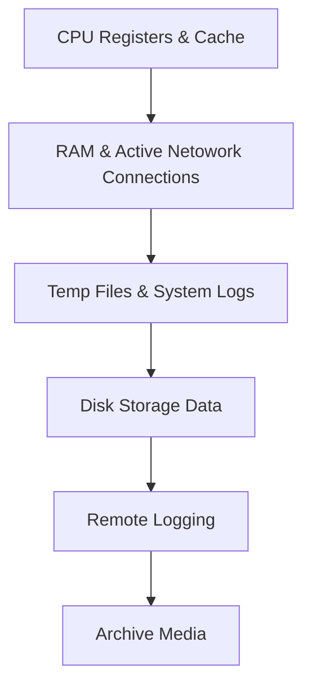

# Digital Forensics Notes

---
## 🔍 Locard's Exchange Principle 🌟

> "Every contact leaves a trace." 🕵️‍♂️

Locard's Exchange Principle, conceptualized by Dr. Edmond Locard, underpins digital forensics by asserting that interactions between systems, devices, or users leave traces. These traces include logs, metadata, digital fingerprints, and artefacts such as deleted files or unauthorized access logs. By meticulously analysing these digital remnants, investigators can link cybercriminals to breaches, uncover unauthorized activities, and reconstruct events. This principle reinforces the importance of detailed data collection and analysis, ensuring accurate attribution and robust evidence in digital investigations.

---

## ⬇Order of Volatility

#### 1. CPU Registers & Cache
- Process Registers
- Cache Memory
- Running Processes
#### 2. RAM & Active Network Connections
- Random Access Memory (Session data)
- Network Connections (Ports/Connections)
- Routing Table
- ARP Cache (Maps IP addresses to MAC addresses)
#### 3. Temp Files & System Logs
- Temporary Files (Temp Directories)
- Swap Files 
- System and Application Logs
#### 4. Disk Storage Data
- Hard Disk Drives
- Solid State Drives
- System Configurations
#### 5. Remote Logging
- Endpoint Telemetry
- Centralized Log Collection
#### 6. Archive Media
- Long-term Storage Media
- Backups 
- Security Controls (C.I.A.)

---
## Chain of Custody
Tracks evidence through the entirety of an investigation. 
Provides integrity of evidence 

---
## 🔍 Windows Registry Keys - The Hidden Treasure Chest 🎩
Windows Registry is a hierarchical database used by Windows to store configuration settings, user preferences, and system information. It can be leveraged for forensic analysis, security investigations, and malware detection.

### 🏠 User Activity Traces
Windows maintains a variety of logs within the registry that record user activity. These keys store historical information that can reveal what actions a user has performed on the system.

- `HKEY_CURRENT_USER\Software\Microsoft\Windows\CurrentVersion\Explorer\TypedPaths`
  - This key stores the paths manually entered into Windows Explorer’s address bar, making it useful for tracking user navigation patterns.
- `HKEY_CURRENT_USER\Software\Microsoft\Windows\CurrentVersion\Explorer\RecentDocs`
  - Stores a list of recently accessed documents, including file names and extensions. This data can reveal what files a user interacted with.
- `HKEY_LOCAL_MACHINE\SOFTWARE\Microsoft\Windows\CurrentVersion\Uninstall`
  - Maintains records of all installed software, including timestamps and version numbers. This information is useful for detecting unauthorized software installations or malware persistence.

### 🔥 Persistence Mechanisms (Malware Hiding Spots)
Threat actors frequently use the registry to establish persistence, ensuring that their malicious payloads execute upon system startup.

- `HKEY_LOCAL_MACHINE\Software\Microsoft\Windows\CurrentVersion\Run`
  - Programs listed under this key automatically launch during startup. Malware often abuses this key to maintain persistence.
- `HKEY_LOCAL_MACHINE\Software\Microsoft\Windows\CurrentVersion\RunOnce`
  - Executes a program once upon the next system startup. Attackers use this method for executing payloads only once to evade detection.
- `HKEY_CURRENT_USER\Software\Microsoft\Windows\CurrentVersion\Policies\Explorer\DisallowRun`
  - This key can be modified to prevent certain applications from executing, potentially used by administrators for security or by malware to disable security tools.

> 🚨 **Pro Tip:** Use **Regedit.exe** or **PowerShell** to analyze and export these registry keys for forensic examination.

---

## Important Forensic Artifacts 🎁

#### config Files 🗃️
**Folder location**: "*C:Windows/System32/config*"

#### %SYSTEMROOT%\System32\Config
|  **File Name** |    **Registry Key**     |  **Description**  |
|----------------|-------------------------|-------------------|
| DEFAULT | HKEY_USERS\.DEFAULT | A registry hive that stores default user profile settings. Useful for determining the system's initial configuration and default behavior before user-specific modifications. |
| SAM (Security Account Manager) | HKEY_LOCAL_MACHINE\SAM | Stores user account and credential information, such as hashed passwords. It is critical for analyzing user accounts, unauthorized access, or privilege escalation attempts. |
| SECURITY | HKEY_LOCAL_MACHINE\SECURITY | Contains system security policies and local security authority settings. Forensic investigators use it to analyze access controls, audit policies, and potential tampering with security configurations. |
| SOFTWARE | HKEY_LOCAL_MACHINE\SOFTWARE | A registry hive containing information about installed software, settings, and system policies. It helps identify installed programs, user preferences, and potentially malicious software. |
| SYSTEM | HKEY_LOCAL_MACHINE\SYSTEM | Stores system-wide configuration data, including services, drivers, and hardware profiles. Forensic investigators analyze it to detect changes to system configurations, malicious drivers, or service persistence mechanisms. |

#### %USERPROFILE%
|  **File Name** |    **Registry Key**     |  **Description**  |
|----------------|-------------------------|-------------------|
| NTUSER.DAT | HKEY_CURRENT_USER | user-specific Windows Registry file that contains configuration settings such as desktop setup and application preferences. It is important in digital forensics for analyzing a user's activities on a computer. |
| USRCLASS.DAT | HKEY_CURRENT_USER\Software\Classes | user-specific Windows Registry file containing settings for software and COM objects associated with a user profile. It is useful in digital forensics for analyzing user behavior and software usage. |

---

## 🏷️ Shell Bags - Windows Explorer’s Memory Bank 🧠
Shell Bags are forensic artifacts that store metadata about folders viewed in Windows Explorer. They help track a user’s interaction with the file system, even if the original folders were deleted.

### 🛡️ Where Are Shell Bags Stored?
Windows stores Shell Bags in the registry under the following keys:

- `HKEY_USERS\{User SID}\Software\Microsoft\Windows\Shell\Bags`
  - Contains folder customization settings such as layout preferences (list view, icon view, etc.).
- `HKEY_USERS\{User SID}\Software\Microsoft\Windows\Shell\BagMRU`
  - Maintains a history of folders accessed by the user, even those on external devices and network shares.

### 📌 What Can You Discover?
Shell Bags contain valuable forensic information, including:

✅ Folder paths and timestamps of access – even if the folder was deleted  
✅ The type of view a user applied to a specific folder (List, Tiles, Details, etc.)  
✅ Evidence of interactions with USB devices, external drives, and network shares  
✅ Metadata related to recently opened or viewed directories

> 🔎 **Forensic Tip:** Extract Shell Bags data using **ShellBagsExplorer** or PowerShell scripts to recover evidence.

### LastVistitedPidlMRU & OpenSavePidlMRU

#### MRU = Most recently used 

`LastVisitedPidlMRU` and `OpenSavePidlMRU` are both registry keys in Microsoft Windows that store information related to the user's recent activity in File Explorer.

Registry Location: 
*`NTUSER.DAT\Software\Microsoft\Windows\CurrentVersion\Explorer\ComDlg32\*`*
Replace `*` with either *`LastVistitedPidlMRU`* Or *`OpenSavePidlMRU`

**LastVisitedPidlMRU**: This registry key tracks the list of recently accessed folders. It stores the item ID lists (PIDLs) of folders that the user has recently visited, helping in populating the recent items or frequent places lists in File Explorer.

**OpenSavePidlMRU**: Similar to LastVisitedPidlMRU, this key stores the PIDLs of recently accessed folders specifically in the context of open and save dialog boxes. It helps in displaying recent folders when a user is opening or saving a file, providing quick access to frequently used locations.

#### Recently Visited Documents

*`NTUSER.DAT\Software\Microsoft\Windows\CurrentVersion\Explorer\RecentDocs`*

The `RecentDocs` key stores entries for each type of document the user has opened. Each entry typically contains information about the file, such as the filename and the path to its location. The purpose of this key is to help populate the "Recent Documents" list in the Windows user interface, allowing users quick access to the files they have recently worked with.

#### Run Dialog Box Recent Executions

*`NTUSER.DAT\Software\Microsoft\Windows\CurrentVersion\Explorer\RunMRU`*

The `RunMRU` key contains entries that record each command entered into the Run dialog, stored as values with the commands themselves and a corresponding identifier. The key allows Windows to display a history of commands when the user accesses the Run dialog box again, providing quick access to previously executed commands.

#### Recently Typed Paths 

*`NTUSER.DAT\Software\Microsoft\Windows\CurrentVersion\Explorer\TypedPaths`*

Each entry in the `TypedPaths` key is typically labeled as `url1`, `url2`, `url3`, etc., and stores the actual path that was typed. By retaining these paths, Windows can offer them as suggestions or autocomplete options when the user begins to type similar paths in the future. This feature improves user efficiency by reducing the amount of typing needed to navigate to commonly used folders or drives.

