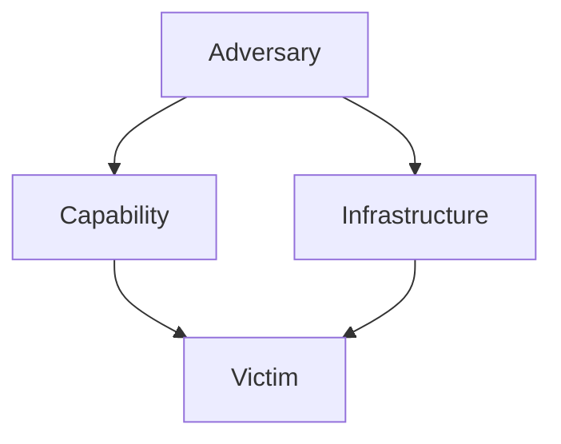

#KA #CTI
# The Diamond Model of Intrusion Analysis 💎

The **Diamond Model of Intrusion Analysis** provides a comprehensive framework for analyzing cyber threats and understanding their behaviors. Developed by Caltagirone, Pendergast, and Betz, this model connects four core components: **Adversary**, **Capability**, **Infrastructure**, and **Victim**. Let’s delve into its intricacies! 🌐

---

## Core Components of the Diamond Model 🛡️

### 1. **Adversary** 👤
- Refers to the threat actor or group conducting the attack.
- Includes motivations, skill levels, and goals.

### 2. **Capability** 🔧
- Represents the tools and techniques employed by the adversary.
- Includes malware, exploits, and manual skills.

### 3. **Infrastructure** 🏗️
- Comprises the systems and networks used to execute the attack.
- Example: Command and Control (C2) servers or compromised hosts.

### 4. **Victim** 🎯
- The target of the attack, such as individuals, organizations, or systems.
- Includes vulnerabilities and organizational weaknesses.

---

## The Diamond in Action: Stuxnet Case Study 🧩

### Visualizing the Stuxnet Attack:

Here’s how the Diamond Model maps onto the infamous Stuxnet cyber operation:

| **Component**      | **Details**                                                                 |
|---------------------|-----------------------------------------------------------------------------|
| **Adversary** 👤   | Nation-state actors with a focus on disrupting Iran's nuclear program.      |
| **Capability** 🔧   | Highly sophisticated malware targeting Siemens industrial control systems. |
| **Infrastructure** 🏗️ | Multiple zero-day exploits, USB propagation, and C2 servers.              |
| **Victim** 🎯       | Iran's Natanz uranium enrichment facility.                                 |

### Diagram 📊

This cyclic representation illustrates the interconnected nature of the attack elements.

---

## Real-World Breakdown 🕵️‍♂️

1. **Adversary Insight:**
   - Nation-state actors designed Stuxnet to sabotage Iran’s nuclear ambitions.
   - Likely collaboration between multiple intelligence agencies.

2. **Capability Details:**
   - Used advanced techniques such as hiding within legitimate processes.
   - Exploited four zero-day vulnerabilities simultaneously.

3. **Infrastructure Utilization:**
   - Leveraged infected USB drives to bypass air-gapped networks.
   - C2 servers located in multiple countries to evade detection.

4. **Victim Impact:**
   - Successfully caused physical damage to centrifuges.
   - Delayed Iran's nuclear program by years.

---

## Why Use the Diamond Model? 🤔

- **Holistic View:** Connects all elements of a cyber operation.
- **Actionable Intelligence:** Guides defenders in identifying attack patterns and preventing future incidents.
- **Scalable:** Applicable to attacks of any complexity.

---

## Key Takeaways 📝

- The Diamond Model simplifies the analysis of complex cyber threats.
- Stuxnet exemplifies how adversaries can integrate advanced capabilities with precise targeting.
- Use this model to **predict, detect, and mitigate** future cyber risks.

### Further Reading 📚
- [The Diamond Model of Intrusion Analysis (Original Paper)](https://www.activeresponse.org/the-diamond-model/)
- [Comprehensive Stuxnet Analysis](https://www.wired.com/story/stuxnet-digital-sabotage/)

---

Stay vigilant, and always think in diamonds! 💎✨
