```mermaid
flowchart TD
A["Reconnaissance"] --> A1["Active Scanning"]

A1 --> A2["Gather Victim Host Information"]

A2 --> A3["Gather Victim Identity Information"]

A3 --> A4["Gather Victim Network Information"]

A4 --> A5["Gather Victim Org Information"]

A5 --> A6["Phishing For Information"]

A6 --> A7["Search Closed Sources"]

A7 --> A8["Search Open Technical Databases"]

A8 --> A9["Search Open Websites/Domains"]

A9 --> A10["Search Victim-Owned Websites"]

B["Resource Devopment"] --> B1["Acquire Access"]

B1 --> B2["Aquire Infrastructure"]

B2 --> B3["Compromise Accounts"]

B3 --> B4["Compromise Infrastructure"]

B4 --> B5["Develop Capabilities"]

B5 --> B6["Establish Accounts"]

B6 --> B7["Obtain Capabilities"]

B7 --> B8["Stage Capabilities"]

C["Initial Access"] --> C1["eContent Injection"]

C1 --> C2["Drive By Compromise"]

C2 --> C3["Exploit Public Facing Application"]

C3 --> C4["External Remote Services"]

C4 --> C5["Hardware Additions"]

C5 --> C6["Phishing"]

C6 --> C7["Replication Through Removable Media"]

C7 --> C8["Supply Chain Compramise"]

C8 --> C9["Trusted Relationship"]

C9 --> C10["Valid Accounts"]

D["Execution"] --> D1["Cloud Administration Command"]

D1 --> D2["Command and Scripting Interpreter"]

D2 --> D3["Container Administration Command"]

D3 --> D4["Deploy Container"]

D4 --> D5["Exploitation for Client Execution"]

D5 --> D6["Inter-Process Communication"]

D6 --> D7["Native API"]

D7 --> D8["Scheduled Task/Job"]

D8 --> D9["Serverless Execution"]

D9 --> D10["Shared Modules"]

D10 --> D11["Software Deployment Tools"]

D11 --> D12["System Services"]

D12 --> D13["User Execution"]

D13 --> D14["Windows Management Instrumentation"]

E["Persistance"] --> E1["Account Manipulation"]

E1 --> E2["BITS Jobs"]

E2 --> E3["Boot or Logon Autostart Execution"]

E3 --> E4["Boot or Logon Initialization Scripts"]

E4 --> E5["Browser Extentions"]

E5 --> E6["Compramise Host Software Binary"]

E6 --> E7["Create Account"]

E7 --> E8["Create or Modify System Process"]

E8 --> E9["Event Triggered Execution"]

E9 --> E10["External Remote Services"]

E10 --> E11["Hijack Execution Flow"]

E11 --> E12["Implant Internal Image"]

E12 --> E13["Modify Authentication Process"]

E13 --> E14["Office Application Startup"]

E14 --> E15["Power Settings"]

E15 --> E16["Pre-OS Boot"]

E16 --> E17["Scheduled Task/Job"]

E17 --> E18["Server Software Component"]

E18 --> E19["Traffic Signaling"]

E19 --> E20["Valid Accounts"]

F["Privilege Escallation"] --> F1["Abuse Elevation Control Mechanism"]

F1 --> F2["Access Token Manipulation"]

F2 --> F3["Account Manipulation"]

F3 --> F4["Boot or Logon Autostart Execution"]

F4 --> F5["Boot or Logon Initialization Scripts"]

F5 --> F6["Create or Modify System Process"]

F6 --> F7["Domain or Tenant Policy Modification"]

F7 --> F8["Escape to Host"]

F8 --> F9["Event Triggered Execution"]

F9 --> F10["Exploitation for Privilege Escalation"]

F10 --> F11["Hijack Execution Flow"]

F11 --> F12["Process Injection"]

F12 --> F13["Schedule Task/Job"]

F13 --> F14["Valid Accounts"]

G["Defense Evasion"] --> G1["Abuse Elevation Control Mechanism"]

G1 --> G2["Access Token Manipulation"]

G2 --> G3["BITS Job"]

G3 --> G4["Build Image on Host"]

G4 --> G5["Debugger Evasion"]

G5 --> G6["Deobfuscate/Decode Files or Information"]

G6 --> G7["Deploy Container"]

G7 --> G8["Direct Volume Access"]

G8 --> G9["Domain or Tenant Policy Modification"]

G9 --> G10["Execution Guardrails"]

G10 --> G11["Exploitation for Defense Evasion"]

G11 --> G12["Files and Directory Permissions Modification"]

G12 --> G13["Hide Artifacts"]

G13 --> G14["Hijack Execution Flow"]

G14 --> G15["Impair Defenses"]

G15 --> G16["Impersonation"]

G16 --> G17["Indicatior Removal"]

G17 --> G18["Indirect Command Exection"]

G18 --> G19["Masquerading"]

G19 --> G20["Modify Authentication Process"]

G20 --> G21["Modify Cloud Compute Infrastructure"]

G21 --> G22["Modify Cloud Resource Hierarchy"]

G22 --> G23["Modify Registry"]

G23 --> G24["Modify System Image"]

G24 --> G25["Network Boundry Bridging"]

G25 --> G26["Obfuscated Files or Information"]

G26 --> G27["Plist Files Modification"]

G27 --> G28["Pre-OS Boot"]

G28 --> G29["Process Injection"]

G29 --> G30["Reflective Code Loading"]

G30 --> G31["Rogue Domain Controller"]

G31 --> G32["Rootkit"]

G32 --> G33["Subvert Trust Controls"]

G33 --> G34["System Binary Proxy Execution"]

G34 --> G35["System Script Proxy Execution"]

G35 --> G36["Template Injection"]

G36 --> G37["Traffic Signaling"]

G37 --> G38["Trusted Developer Utilises Proxy Execution"]

G38 --> G39["Unused/Unsuported Cloud Regions"]

G39 --> G40["Use Alternate Authentication Material"]

G40 --> G41["Valid Accounts"]

G41 --> G42["Virtualization/Sandbox Evasion"]

G42 --> G43["Weaken Encryption"]

G43 --> G44["XSL Script Processing"]

H["Credential Access"] --> H1["Adversary-In-The-Middle"]

H1 --> H2["Brute Force"]

H2 --> H3["Credentials from Password Strores"]

H3 --> H4["Exploitation for Credential Access"]

H4 --> H5["Forced Authentication"]

H5 --> H6["Forge Web Credentials"]

H6 --> H7["Input Capture"]

H7 --> H8["Modify Authentication Process"]

H8 --> H9["Multi-Factor Authentication Interception"]

H9 --> H10["Multi-Factor Authentication Request Generation"]

H10 --> H11["Network Sniffing"]

H11 --> H12["OS Credential Dumping"]

H12 --> H13["Steal Application Access Token"]

H13 --> H14["Steal or Forge Authentication Certificates"]

H14 --> H15["Steal or Forge Kerberos Tickets"]

H15 --> H16["Steal Web Session Cookie"]

H16 --> H17["Unsecured Credentials"]

I["Discovery"] --> I1["Account Discovery"]

I1 --> I2["Application Window Discovery"]

I2 --> I3["Browser Information Discovery"]

I3 --> I4["Cloud Infrastucture Discovery"]

I4 --> I5["Cloud Service Dashboard"]

I5 --> I6["Cloud Service Discovery"]

I6 --> I7["Cloud Storage Object Discovery"]

I7 --> I8["Container and Resource Discovery"]

I8 --> I9["Debugger Evasion"]

I9 --> I10["Device Driver Discovery"]

I10 --> I11["Domain Trust Discovery"]

I11 --> I12["Files and Directory Discovery"]

I12 --> I13["Group Policy Discovery"]

I13 --> I14["Log Enumeration"]

I14 --> I15["Network Service Discovery"]

I15 --> I16["Network Share Discovery"]

I16 --> I17["Network Sniffing"]

I17 --> I18["Password Policy Discovery"]

I18 --> I19["Peripheral Device Discovery"]

I19 --> I20["Permission Groups Discovery"]

I20 --> I21["Process Discovery"]

I21 --> I22["Query Registry"]

I22 --> I23["Remote System Discovery"]

I23 --> I24["Software Discovery"]

I24 --> I25["System Information Discovery"]

I25 --> I26["System Location Discovery"]

I26 --> I27["System Network Configuration Discovery"]

I27 --> I28["System Network Connection Discovery"]

I28 --> I29["System Owner/User Discovery"]

I29 --> I30["System Service Discovery"]

I30 --> I31["System Time Discovery"]

I31 --> I32["Virtualization/Sandbox Evasion"]

J["Lateral Movement"] --> J1["Exploitation of Remote Services"]

J1 --> J2["Internal Spearphishing"]

J2 --> J3["Leteral Tool Transfer"]

J3 --> J4["Remote Service Session Hijacking"]

J4 --> J5["Remote Services"]

J5 --> J6["Replication Through Removable Media"]

J6 --> J7["Software Deployment Tools"]

J7 --> J8["Taint Shared Content"]

J8 --> J9["Use Alternative Authentication Material"]

K["Collection"] --> K1["Adversary-In-The-Middle"]

K1 --> K2["Archive Collected Data"]

K2 --> K3["Audio Capture"]

K3 --> K4["Automated Collection"]

K4 --> K5["Browser Session Hijacking"]

K5 --> K6["Clipboard Data"]

K6 --> K7["Data from Cloud Storage"]

K7 --> K8["Data from Configuration Repositories"]

K8 --> K9["Data from Information Repositories"]

K9 --> K10["Data from Local System"]

K10 --> K11["Data from Network Shared Drive"]

K11 --> K12["Data from Removable Media"]

K12 --> K13["Data Staged"]

K13 --> K14["Email Collection"]

K14 --> K15["Input Capture"]

K15 --> K16["Screen Capture"]

K16 --> K17["Video Capture"]

L["Command and Control"] --> L1["Application Layer Protocol"]

L1 --> L2["Communication Through Removable Media"]

L2 --> L3["Content Injection"]

L3 --> L4["Data Encoding"]

L4 --> L5["Data Obfuscation"]

L5 --> L6["Dynamic Resolution"]

L6 --> L7["Encrypted Channel"]

L7 --> L8["Fallback Channels"]

L8 --> L9["Hide Infrastructure"]

L9 --> L10["Ingress Tool Transfer"]

L10 --> L11["Multi-Stage Channels"]

L11 --> L12["Non-Application Layer Protocol"]

L12 --> L13["Non-Standard Port"]

L13 --> L14["Protocol Tunneling"]

L14 --> L15["Proxy"]

L15 --> L16["Remote Access Software"]

L16 --> L17["Traffic Signaling"]

L17 --> L18["Web Service"]

M["Exfiltration"] --> M1["Automated Exfiltration"]

M1 --> M2["Data Transfer Size Limits"]

M2 --> M3["Exfiltration Over Alterative Protocol"]

M3 --> M4["Exfiltration Over C2 Channel"]

M4 --> M5["Exfiltration Over Other Network Medium"]

M5 --> M6["Exfiltration Over Phisical Medium"]

M6 --> M7["Exfiltration over Web Service"]

M7 --> M8["Schedule Transfer"]

M8 --> M9["Transfer Data To Cloud Account"]

N["Impact"] --> N1["Account Acccess Removal"]

N1 --> N2["Data Destruction"]

N2 --> N3["Data Encrypted for Impact"]

N3 --> N4["Data Manipulation"]

N4 --> N5["Defacement"]

N5 --> N6["Disk Wipe"]

N6 --> N7["Endpoint Denial of Service"]

N7 --> N8["Financial Theft"]

N8 --> N9["Firmware Corruption"]

N9 --> N10["Inhibit System Recovery"]

N10 --> N11["Network Denial Of Service"]

N11 --> N12["Resource Hijacking"]

N12 --> N13["Service Stop"]

N13 --> N14["System Shutdown/Reboot"]

  

style A stroke-width:4px,stroke-dasharray: 0

style B stroke-width:4px,stroke-dasharray: 0

style C stroke-width:4px,stroke-dasharray: 0

style D stroke-width:4px,stroke-dasharray: 0

style E stroke-width:4px,stroke-dasharray: 0

style F stroke-width:4px,stroke-dasharray: 0

style G stroke-width:4px,stroke-dasharray: 0

style H stroke-width:4px,stroke-dasharray: 0

style I stroke-width:4px,stroke-dasharray: 0

style J stroke-width:4px,stroke-dasharray: 0

style K stroke-width:4px,stroke-dasharray: 0

style L stroke-width:4px,stroke-dasharray: 0

style M stroke-width:4px,stroke-dasharray: 0

style N stroke-width:4px,stroke-dasharray: 0
```

# MITRE ATT&CK Framework 🎯
#KA #CTI 

Welcome to the **MITRE ATT&CK Framework** documentation! This page provides a comprehensive breakdown of the framework, its features, and a deep dive into every component. 

---

---
## What is the MITRE ATT&CK Framework? 🌐

The **MITRE ATT&CK Framework** is a globally-accessible knowledge base of adversary tactics and techniques based on real-world observations. It provides a structured approach to understanding, defending against, and mitigating cyber threats.

---

## Features 🚀

- **Comprehensive Knowledge Base:** Documented techniques and tactics based on real-world cyber threats.
- **Defensive Strategy Insights:** Guides security teams on identifying and mitigating threats effectively.
- **Customization:** Tailored to fit different industries and organizations.
- **Community Support:** Widely used and constantly updated by cybersecurity experts.

---

## Diagram Overview 📊

---

## Framework Breakdown 🛠️

The MITRE ATT&CK Framework is organized into three key areas:

### 1. **Tactics** 🗺️
Tactics represent the high-level objectives adversaries aim to achieve during an attack. These include:

- **Initial Access**: Gaining access to the target environment.
- **Execution**: Running malicious code.
- **Persistence**: Maintaining foothold in the environment.
- **Privilege Escalation**: Gaining higher permissions.
- **Defense Evasion**: Avoiding detection.
- **Credential Access**: Stealing account credentials.
- **Discovery**: Learning about the environment.
- **Lateral Movement**: Moving within the network.
- **Collection**: Gathering data of interest.
- **Exfiltration**: Sending data out of the network.
- **Command and Control (C2)**: Communicating with compromised systems.

### 2. **Techniques** 🧩
Techniques describe how tactics are achieved. Examples include:

- **Phishing (T1566):** Sending malicious emails to trick users.
- **Spearphishing Attachment (T1566.001):** Using tailored email attachments.
- **Credential Dumping (T1003):** Extracting password hashes.
- **DLL Injection (T1055.001):** Injecting code into legitimate processes.

### 3. **Mitigations** 🔒
Mitigations provide defensive measures to counter specific techniques. Examples include:

- **User Training**: Educating users about phishing.
- **Endpoint Protection**: Deploying EDR solutions.
- **Network Segmentation**: Restricting lateral movement.
- **Multi-factor Authentication**: Strengthening account security.

---

## Why Use MITRE ATT&CK? 💡

1. **Improved Detection:** Enhances threat detection by understanding adversary behavior.
2. **Gap Analysis:** Identifies weaknesses in your defenses.
3. **Red and Blue Teaming:** Facilitates simulation and defense exercises.
4. **Threat Intelligence Alignment:** Matches observed activities to known adversary behaviors.

---

## How to Get Started 📖

1. **Visit the ATT&CK Matrix**:
   Explore the official [MITRE ATT&CK Matrix](https://attack.mitre.org/) for an interactive experience.

2. **Map Your Threats**:
   Identify tactics and techniques relevant to your organization.

3. **Integrate Tools**:
   Utilize tools like ATT&CK Navigator to customize your framework.

---

## Resources 📚

- **Official Website:** [MITRE ATT&CK](https://attack.mitre.org/)
- **ATT&CK Navigator:** Visualize and customize the matrix.
- **Threat Intelligence Sources:** Stay up-to-date with the latest adversary techniques.
- **Community Forum:** Join discussions with other cybersecurity professionals.

---

## Conclusion 🎉

The MITRE ATT&CK Framework is an indispensable tool for modern cybersecurity. Its structured approach to adversary behavior helps organizations enhance their defenses and respond effectively to threats.

**Start leveraging the power of MITRE ATT&CK today!**
