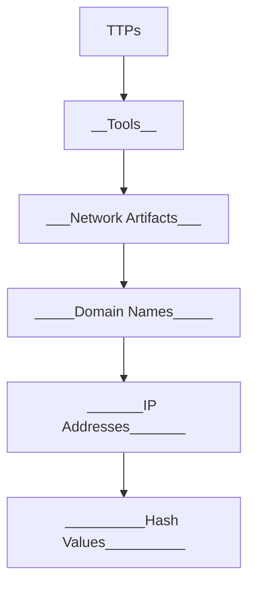

#KA #CTI 
# The Pyramid of Pain

## 🛡️ Understanding the Pyramid of Pain Framework

The **Pyramid of Pain** is a cybersecurity model introduced by David J. Bianco to illustrate the difficulty of detecting and defending against various Indicators of Compromise (IOCs). Each layer of the pyramid represents a type of IOC, increasing in both complexity and effectiveness when used to thwart adversaries.

---

### 📊 **The Pyramid of Pain Diagram**

| **Layer**       | **Description**                                                | **Examples**                          |
|------------------|---------------------------------------------------------------|---------------------------------------|
| **TTPs**        | Tactics, Techniques, and Procedures. High impact for defense. | Spear-phishing, privilege escalation |
| **Tools**       | Specific tools adversaries use.                               | Mimikatz, Metasploit                 |
| **Network Artifacts** | Data generated by malicious activity on the network.         | IPs, HTTP requests                   |
| **Domain Names**| Adversary-controlled domains.                                  | Malicious C2 domains                 |
| **IP Addresses**| IPs associated with threat actors.                             | 192.168.1.1 (malicious endpoint)     |
| **Hash Values** | File hashes identifying malware or tools.                      | MD5, SHA256                          |

---

### 🧩 **Why the Pyramid of Pain Matters**

The Pyramid of Pain is designed to:

- **🎯 Highlight Effective Detection**: Prioritize high-value IOCs for maximum impact.
- **🚀 Challenge Adversaries**: Increasing their operational cost with robust defenses.
- **🧠 Enable Proactive Responses**: Understanding adversary behavior for future-proof strategies.

---

#### 🖼️ Embedded Diagrams

Use tools like Mermaid for diagram creation directly within GitHub Pages:

---

### 📚 **Additional Resources**

- 📖 [Original Blog Post by David J. Bianco](https://detect-respond.blogspot.com/2013/03/the-pyramid-of-pain.html)
- 🌐 [MITRE ATT&CK Framework](https://attack.mitre.org)
- 🛠️ [Cyber Threat Intelligence Resources](https://cti.link)

---

### 🤝 **Get Involved**

- Contribute to this repository to expand knowledge on the Pyramid of Pain.
- Share your experiences with IOCs and how you tackle adversaries!

---

## 🚀 Let’s Make Defenders Stronger Together!

---
