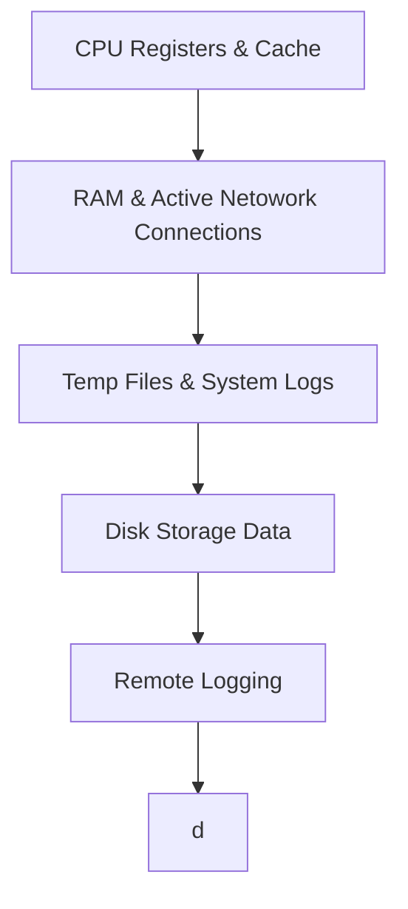

# Digital Forensics Notes

---
# 🔍 Locard's Exchange Principle 🌟

> "Every contact leaves a trace." 🕵️‍♂️

Locard's Exchange Principle, conceptualized by Dr. Edmond Locard, underpins digital forensics by asserting that interactions between systems, devices, or users leave traces. These traces include logs, metadata, digital fingerprints, and artefacts such as deleted files or unauthorized access logs. By meticulously analysing these digital remnants, investigators can link cybercriminals to breaches, uncover unauthorized activities, and reconstruct events. This principle reinforces the importance of detailed data collection and analysis, ensuring accurate attribution and robust evidence in digital investigations.

---

# ⬇Order of Volatility

#### 1. CPU Registers & Cache
- Process Registers
- Cache Memory
- Running Processes
#### 2. RAM & Active Network Connections
- Random Access Memory (Session data)
- Network Connections (Ports/Connections)
- Routing Table
- ARP Cache (Maps IP addresses to MAC addresses)
#### 3. Temp Files & System Logs
- Temporary Files (Temp Directories)
- Swap Files 
- System and Application Logs
#### 4. Disk Storage Data
- Hard Disk Drives
- Solid State Drives
- System Configurations
#### 5. Remote Logging
- Endpoint Telemetry
- Centralized Log Collection
#### 6. Archive Media
- Long-term Storage Media
- Backups 
- Security Controls (C.I.A.)
---
# Chain of Custody
Tracks evidence through the entirety of an investigation. 
Provides integrity of evidence 