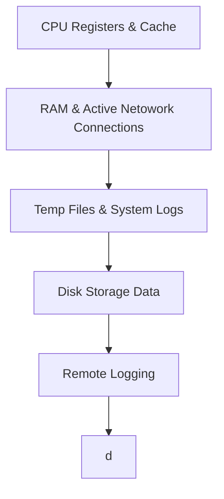

# Digital Forensics Notes

---
## 🔍 Locard's Exchange Principle 🌟

> "Every contact leaves a trace." 🕵️‍♂️

Locard's Exchange Principle, conceptualized by Dr. Edmond Locard, underpins digital forensics by asserting that interactions between systems, devices, or users leave traces. These traces include logs, metadata, digital fingerprints, and artefacts such as deleted files or unauthorized access logs. By meticulously analysing these digital remnants, investigators can link cybercriminals to breaches, uncover unauthorized activities, and reconstruct events. This principle reinforces the importance of detailed data collection and analysis, ensuring accurate attribution and robust evidence in digital investigations.

---

## ⬇Order of Volatility

#### 1. CPU Registers & Cache
- Process Registers
- Cache Memory
- Running Processes
#### 2. RAM & Active Network Connections
- Random Access Memory (Session data)
- Network Connections (Ports/Connections)
- Routing Table
- ARP Cache (Maps IP addresses to MAC addresses)
#### 3. Temp Files & System Logs
- Temporary Files (Temp Directories)
- Swap Files 
- System and Application Logs
#### 4. Disk Storage Data
- Hard Disk Drives
- Solid State Drives
- System Configurations
#### 5. Remote Logging
- Endpoint Telemetry
- Centralized Log Collection
#### 6. Archive Media
- Long-term Storage Media
- Backups 
- Security Controls (C.I.A.)

---
## Chain of Custody
Tracks evidence through the entirety of an investigation. 
Provides integrity of evidence 

## Important Forensic Artifacts 🎁

#### config Files 🗃️
**Folder location**: "*C:Windows/System32/config*"

#### %SYSTEMROOT%\System32\Config
|  **File Name** |    **Registry Key**     |  **Description**  |
|----------------|-------------------------|-------------------|
| DEFAULT | HKEY_USERS\.DEFAULT | A registry hive that stores default user profile settings. Useful for determining the system's initial configuration and default behavior before user-specific modifications. |
| SAM (Security Account Manager) | HKEY_LOCAL_MACHINE\SAM | Stores user account and credential information, such as hashed passwords. It is critical for analyzing user accounts, unauthorized access, or privilege escalation attempts. |
| SECURITY | HKEY_LOCAL_MACHINE\SECURITY | Contains system security policies and local security authority settings. Forensic investigators use it to analyze access controls, audit policies, and potential tampering with security configurations. |
| SOFTWARE | HKEY_LOCAL_MACHINE\SOFTWARE | A registry hive containing information about installed software, settings, and system policies. It helps identify installed programs, user preferences, and potentially malicious software. |
| SYSTEM | HKEY_LOCAL_MACHINE\SYSTEM | Stores system-wide configuration data, including services, drivers, and hardware profiles. Forensic investigators analyze it to detect changes to system configurations, malicious drivers, or service persistence mechanisms. |

#### %USERPROFILE%
|  **File Name** |    **Registry Key**     |  **Description**  |
|----------------|-------------------------|-------------------|
| NTUSER.DAT | HKEY_CURRENT_USER | user-specific Windows Registry file that contains configuration settings such as desktop setup and application preferences. It is important in digital forensics for analyzing a user's activities on a computer. |
| USRCLASS.DAT | HKEY_CURRENT_USER\Software\Classes | user-specific Windows Registry file containing settings for software and COM objects associated with a user profile. It is useful in digital forensics for analyzing user behavior and software usage. |
