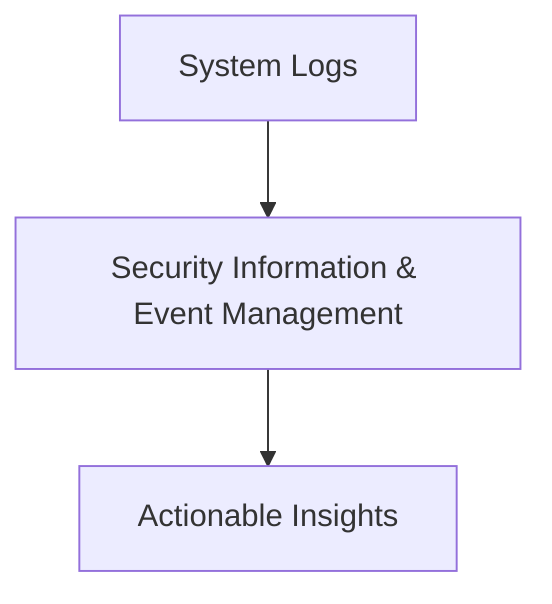

# My_Vault 🛡️

Welcome to **My_Vault** – your ultimate repository for all things **cybersecurity**! 🔐 Whether you're a seasoned professional or a curious learner, this repository offers a rich collection of resources designed to enhance your skills and knowledge. 

---

## Table of Contents 📚

- [Cheat Sheets](#cheat-sheets)
  - [DNS Query Types](#dns-query-types)
  - [HTTP Response Codes](#http-response-codes)
  - [Keyboard Shortcuts Linux](#keyboard-shortcuts-linux)
  - [Keyboard Shortcuts Windows](#keyboard-shortcuts-windows)
  - [Linux Commands](#linux-commands)
  - [Markdown Cheatsheet](#markdown-cheatsheet)
  - [Ports & Protocols](#ports--protocols)
  - [Regex Cheat Sheet](#regex-cheat-sheet)
  - [Splunk Query Language](#splunk-query-language)
  - [Sysmon Event ID's](#sysmon-event-ids)
  - [Windows Commands](#windows-commands)
  - [Windows Event Codes](#windows-event-codes)
- [Knowledge Articles](#knowledge-articles)
  - [Anatomy of a URL](#anatomy-of-a-url)
  - [Common Attack Types](#common-attack-types)
  - [Diamond Model of Intrusion Analysis](#diamond-model-of-intrusion-analysis)
  - [EDR Analysis](#edr-analysis)
  - [Email Attachment Analysis](#email-attachment-analysis)
  - [Email Headers](#email-headers)
  - [Malware Types](#malware-types)
  - [Pyramid Of Pain](#pyramid-of-pain)
  - [SOC Fundamentals](#soc-fundamentals)
  - [The Cyber Kill Chain](#the-cyber-kill-chain)
- [Tooling](#tooling)
  - [Burp Suite](#burp-suite)
  - [Curl](#curl)
  - [DNS Recon](#dns-recon)
  - [FFUF](#ffuf)
  - [Fcrackzip](#fcrackzip)
  - [LDAP Domain Dump](#ldap-domain-dump)
  - [NMAP](#nmap)
  - [Net Cat](#net-cat)
  - [Nikto](#nikto)
  - [Responder](#responder)
  - [Searchsploit](#searchsploit)
  - [TCP Dump](#tcp-dump)
  - [Kali Tools](#kali-tools)

---

## Overview 🌟

**My_Vault** serves as a comprehensive reference hub, housing essential resources for cybersecurity enthusiasts and professionals. Here, you'll find categorized information, tools, and tips that you can quickly access to:

- Sharpen your **defensive** and **offensive** skills ⚔️
- Decode cryptic **event and response codes** 🔍
- Dive deep into **malware investigation** 🕵️‍♂️
- Equip yourself with **cheatsheets** for quick problem-solving ⚡

---

## Categories 🗂️

### Tooling ⚙️
- 🛠️ **Popular Tools**: A curated list of tools for penetration testing, network analysis, and system hardening.
- 💻 **Automation Scripts**: Boost your productivity with pre-built scripts.

```
# Example Tool Commands
nmap -sV -p- 192.168.1.1   # Scan all ports on a target
metasploit-framework       # Exploit development framework
```

---

### Analysis 🔬
- 📊 **Network Traffic Analysis**: Best practices and tools.
- 🖥️ **Log Analysis**: Extract insights from system and application logs.



---

### Cheatsheets 📄
- 🧾 **Command Cheatsheets**: Essential Linux, Windows, and network commands.
- 📝 **Regular Expressions**: Quick reference for regex patterns.

| Command  | Usage                       |
|----------|-----------------------------|
| `grep`   | Search text in files       |
| `awk`    | Process and extract data   |
| `sed`    | Stream editor              |

---

### Event Codes & Response Codes 🚦
- 🔑 **Windows Event Codes**: Decode critical security events.
- 🌐 **HTTP Response Codes**: Understand server responses.

| Event ID | Description                           |
|----------|---------------------------------------|
| 4625     | Failed login attempt                 |
| 5140     | File share accessed                  |
| 4688     | Process creation                     |

---

### Query Languages 🔍
- **SQL for Cybersecurity**
- **Splunk Search Processing Language (SPL)**
- **KQL (Kusto Query Language)**

```sql
-- Example: Find suspicious logins
SELECT *
FROM logins
WHERE login_status = 'failed';
```

---

### Malware Investigation 🕵️
- **Static and Dynamic Analysis Tools**
- **Common Indicators of Compromise (IoCs)**

```plaintext
IoC Example:
- Suspicious file hash: e99a18c428cb38d5f260853678922e03
- C2 IP Address: 192.168.100.10
```

---

### Red & Blue Team Operations 🚀
- 🔴 **Red Team**: Penetration testing guides and tools.
- 🔵 **Blue Team**: Defense strategies and incident response.


---

> 🛡️ Stay secure and keep learning!